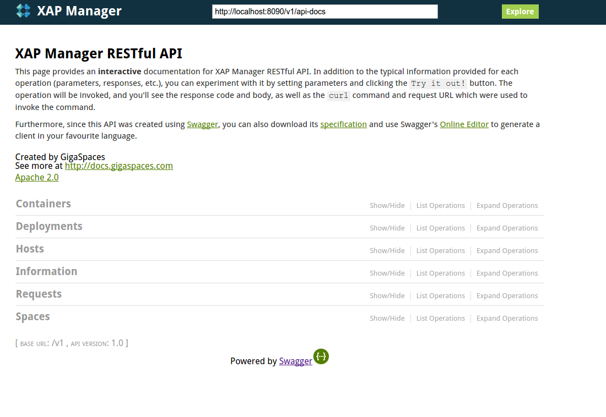
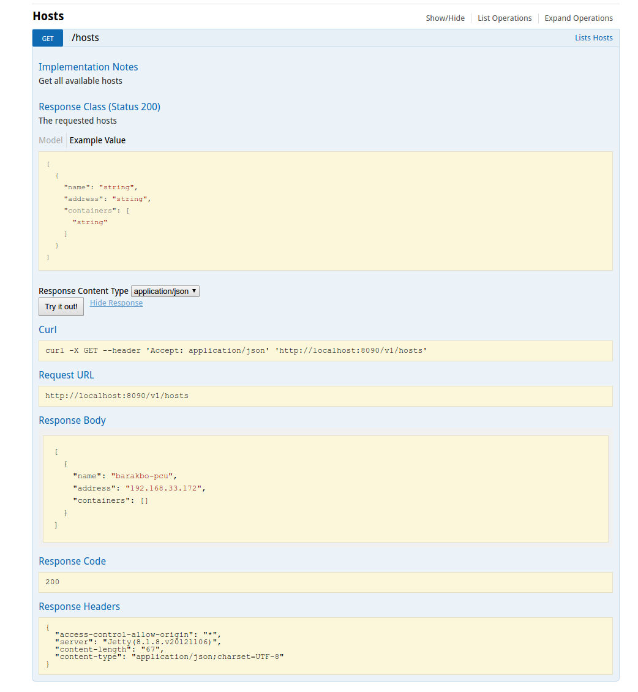
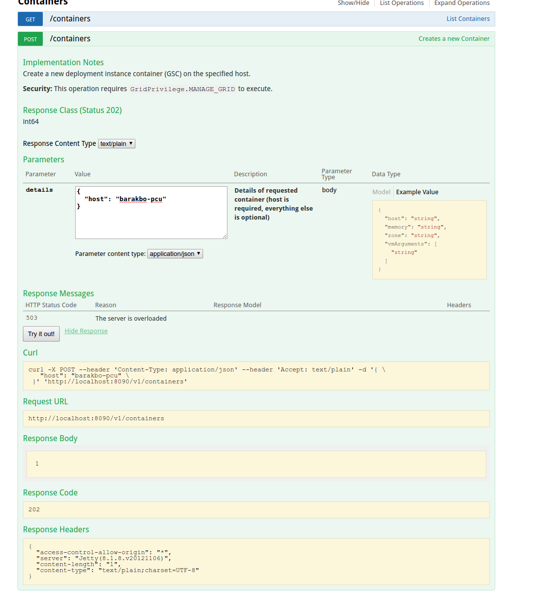
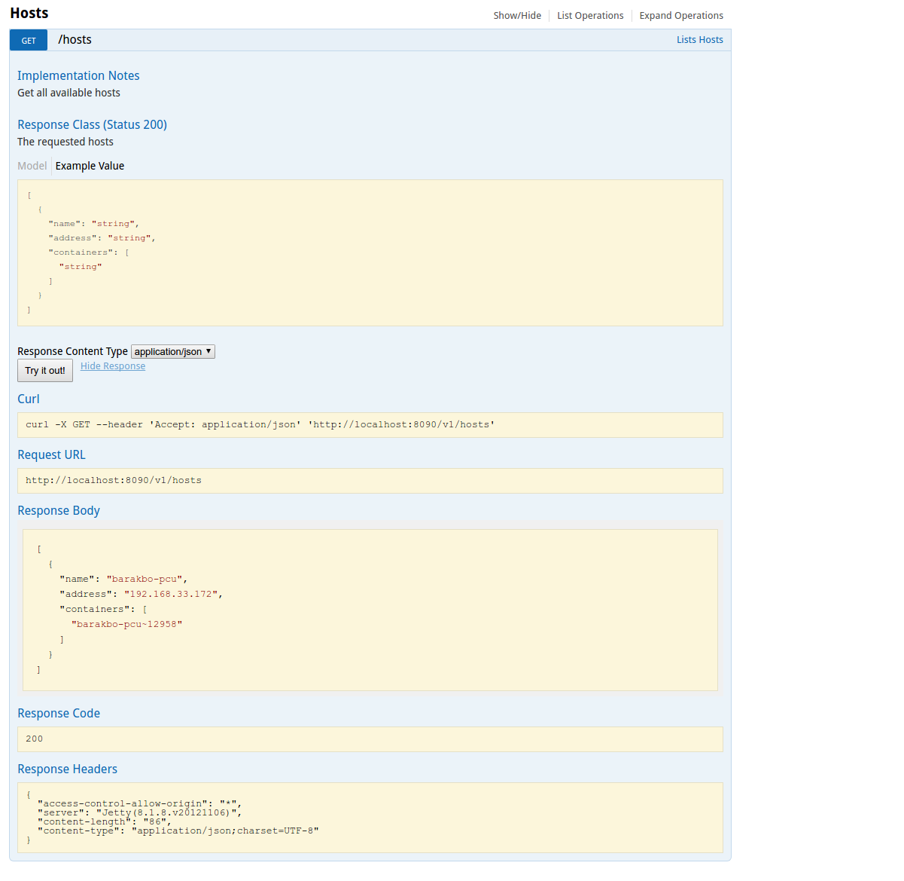

Using remote Read Eval Print Loop (REPL) to control XAP
=======================================================

With the new XAP 12.1 there is a new cool admin REST API that make it possible to perform administration action on the grid.
In this tutorial I will show how to install XAP 12.1 and run the new REST API.
I will describe the REST functionality and at the end I will show how to use a Scala REPL that has embedded client to this rest server to automate tasks on the grid remotly.

First we will need to download [XAP 12.1](https://www.gigaspaces.com/xap-download) you will need to have a version with the `REST Cloud-Native Orchestration`.
Once you download and unpacked the zip.
Next you will have to get license from the gigaspaces site once you have it you can put it in the file `xap-license.txt` in the dir that was created by the zip.

Edit the file `setenv-overrides.sh`  add the line `export XAP_MANAGER_SERVERS=your-host-name`
replace `your-host-name` with your real host name. 
Now you are ready to run the system in local mode, to do that you should type './gs-agent.sh --manager-local' from a terminal that opened in XAP the `bin` directory 
If you browse to `http://localhost:8090/v1/index.html` you will see a nice swagger page that describe the ADMIN REST API and let you try it.
 


You can try to hosts view, getting all hosts in the system, currently there should be only one host with no containers.



To create a new container open the containers section and select the first Post (where the description is "Create a new container")
Fill in the host param as show in the image and push the `try it out` button



You can verify that a container was created by getting all hosts and see that you host has a container.



Using this REST API it is possible to manage the grid from annoyware using the language you choose.
It is possible to upload jars to the grid and then deploy processes using those jars.
It is also possible to create instance of spaces on a node in the grid.

One spesific client that Gigaspaces providing is the Admin REPL, it is a Scala based REPL that has the REST embedded as primitives commands.
This REPL has the following cool features:

* It support autocomplete.
* It is asynchronous by nature.
* It provide Scala as a glue language for the REST primitives.
* The command implemented in a way that it is very easy to compose command together.
* It enable running batch scripts that are doing work against the system.

Lets start up the REPL and see how it work.

Unzip the file `demo-repl.zip`
go into the directory where the file a`admin-repl.sh` is found and define the system environment `restUrl`  
 `export restUrl=<YOUR_REST_URL>` in my case `export restUrl=http://your-host-name:8090/v1` again replace `your-host-name` with your real host name.
 
The repl shoud start with the url ends with @ as a prompt
Type hosts as the first rest command.

```Bash
http://barakbo-pcu:8090/v1@ hosts 
res2: Future[List[Host]] = Promise@147296487(state=Transforming(List(),Promise@464349589(state=Transforming(List(<function1>),Promise@783042794(state=Transforming(List(<function1>),Promise@279707594(state=Transforming(List(<function1>),Future@2132041506(depth=2,parent=Promise@450962180(state=Transforming(List(<function1>, <function1>, <function1>),Promise@993116346(state=Transforming(List(<function1>),Future@1881654105(depth=1,parent=Promise@1545356473(state=Transforming(List(<function1>, <function1>),Promise@1845290909(state=Transforming(List(<function1>),Future@254677784(depth=1,parent=Promise@1587539421(state=Transforming(List(<function1>, <function1>),Future@1729841184(depth=1,parent=Promise@1688239445(state=Transforming(List(<function1>, <function1>),Future@984348334(depth=1,parent=Promise@1739251556(state=Transforming(List(<function1>, <function1>),Future@1951979433(depth=1,parent=Promise@1633309010(state=Transforming(List(<function1>, <function1>),Promise@1393373445(state=Transforming(List(<function1>),Promise@922136563(state=Transforming(List(<function1>),Promise@194100457(state=Interruptible(List(<function1>),<function1>))))))))))))))))))))))))))))))))))))
```

Hoo what happen here ? since every REST command is asynchronous in the REPL it return a Scala future, we can wait on the future or add listener that will called when the future will be resolved.
Lets start to wait on the future first:

```Bash
http://barakbo-pcu:8090/v1@ hosts get 
res3: List[Host] = List(Host("barakbo-pcu", "192.168.33.172", List()))
```
This is nicer, we can work with it.

```Bash
res4 foreach println 
Host(barakbo-pcu,192.168.33.172,List())
```

Lets try to create 2 jvm (gsc) on our machine.

```Bash
http://barakbo-pcu:8090/v1@ containers get  
res6: List[DeploymentInstanceContainer] = List()

http://barakbo-pcu:8090/v1@ startContainer("barakbo-pcu") get 
res7: DeploymentInstanceContainer = DeploymentInstanceContainer("barakbo-pcu~15240", 15240, List(), List())

http://barakbo-pcu:8090/v1@ containers get 
res8: List[DeploymentInstanceContainer] = List(DeploymentInstanceContainer("barakbo-pcu~15240", 15240, List(), List()))

http://barakbo-pcu:8090/v1@ startContainer("barakbo-pcu") get 
res9: DeploymentInstanceContainer = DeploymentInstanceContainer("barakbo-pcu~15479", 15479, List(), List())

http://barakbo-pcu:8090/v1@ containers get 
res10: List[DeploymentInstanceContainer] = List(DeploymentInstanceContainer("barakbo-pcu~15479", 15479, List(), List()), DeploymentInstanceContainer("barakbo-pcu~15240", 15240, List(), List()))
```
We have 2 containers so we can deploy space on those containers.

```Bash
http://barakbo-pcu:8090/v1@ deploySpace("aSpace", 2, false) get 
res11: Space = Space("aSpace", "aSpace", DeploymentTopology(Some("partitioned"), None, Some(2), Some(0)), List("aSpace~2", "aSpace~1"))
```

Note that deploySpace return a future that contains space that resolved when the space deplyment failed or success where the REST api return only request submitted code and you have to do the polling for the result.

```Bash
http://barakbo-pcu:8090/v1@ spaces get 
res12: List[Space] = List(Space("aSpace", "aSpace", DeploymentTopology(Some("partitioned"), None, Some(2), Some(0)), List("aSpace~2", "aSpace~1")))
```

```Bash
http://barakbo-pcu:8090/v1@ rmDeployment("aSpace") 
res15: Future[Deployment] = Promise@541397596(state=Transforming(List(),Promise@1579097076(state=Interruptible(List(<function1>),<function1>))))
```

You can type `help` to see all the REPL REST commands.
 
A Scala program that use the REST commands can be run as batch using the command `admin-repl.sh program.sc`
 
Now lets start to write something more interesting using the REPL script.
 
Put the following Scala code into the file `deploy-example.sc`
 
```Scala
@main
def main(args: String*) = {
  println(args)
}
```

You can run this code (and passing arguments to it) using the command `./admin-repl.sh deploy-example.sc  foo bar`
The output of the println should be `ArrayBuffer(foo, bar)`

Lets add some REPL command to the script

```Scala
@main
def main(args: String*) = {
  println(space.get)
}
```
You should get the empty list when running this command

Now lets try to create 3 jvm concurrently and waiting for them to run

```Scala
def killAllContainers = containers.get.map(c => killContainer(c.id).get)

@main
def main(args: String*) = {
  println("removing all containers")
  killAllContainers
  println("starting containers")
  val c = (Future.collect((0 to 3).map(_ => startContainer("barakbo-pcu"))).get)
  println("starting containers done " + c.map(_.id))
}

```

This script first remove all containers oon the system and then starting 3 containers waiting them to be ready and print their ids.
The output should be:

```Scala
barakbo-pcu:repl $ ./admin-repl.sh deploy-example.sc  
restUrl=http://barakbo-pcu:8090/v1
(deploy-example.sc,0)
removing all containers
Apr 03, 2017 5:58:33 PM com.twitter.finagle.Init$$anonfun$4 apply$mcV$sp
INFO: Finagle version 6.42.0 (rev=f48520b6809792d8cb87c5d81a13075fd01c051d) built at 20170203-165908
starting containers
starting containers done ArraySeq(barakbo-pcu~22820, barakbo-pcu~22858, barakbo-pcu~22819, barakbo-pcu~22837)

```

Similarly we can write a script that upload the processing unit sources and at the same time start containers.
When all the download and the containers are ready, it deploy all the processing unit concurrently and wait for them to finish.

We can combine REST commands in the following ways:

1. sequentially one after another using flat and flatmap for example
 
 For example given 2 container ids we wish to restart them one after another.
 We can write the following code
 
 ```Scala
 
    // given the REPL primitive: restartContainer(id: String): Future[com.gigaspaces.rest.finagle.model.DeploymentInstanceContainer]
    
    def restart2(id1: String, id2: String): Future[(String, String)] = restartContainer(id1).flatMap(deployment1 => restartContainer(id2).map(deployment2 => (deployment1.id, deployment2.id)))
    
    // we can now call this function with ids of 2 containers to restart.
    // since it returns future with a tuble of the containers id we can wait on the result with get.
    // notice that we will get 2 new ids since the container id contains the process id and the process is new.
    
    restart2("barakbo-pcu~15380", "barakbo-pcu~15464").get
    
    // > res6: (String, String) = ("barakbo-pcu~15932", "barakbo-pcu~16024")
       
 ```
 
 We can write restart2 using Scala for comprehension.
 
 ```Scala
  
     def restart2(id1: String, id2: String): Future[(String, String)] = for{
        deployment1 <- restartContainer(id1)
        deployment2 <- restartContainer(id2)
     }yield(deployment1.id, deployment2.id)
     
  ```
2. Or we can send all the action concurently (since the containers are not depend on each other) and wait for the results.
 
 ```Scala
  
     
     def restart2(id1: String, id2: String): Future[(String, String)] = {
         val f1 = restartContainer(id1)
         val f2 = restartContainer(id2)
         f1.flatMap(deployment1 => f2.map(deployment2 => (deployment1.id, deployment2.id)))
     }
        
  ```
  This code should run at half time, try it out !
  Again we can use scala for comprehension.
  
 ```Scala
    
       def restart2(id1: String, id2: String): Future[(String, String)] = {
           val f1 = restartContainer(id1)
           val f2 = restartContainer(id2)
           for{
              deployment1 <- f1
              deployment2 <- f2
           }yield(deployment1.id, deployment2.id)
       }
       
 ```
Wait you say, this is nice but I don't have 2 containers I have a list of them, can I compose sequentially and parallel list of items ?
As it turn out you can and it is even easy, so lets do that.

 ```Scala
       import com.gigaspaces.rest.finagle.model
       
       def restart(ids: Seq[String]): Future[Seq[String]] = {
           val res : Future[Seq[DeploymentInstanceContainer]]  = Future.traverseSequentially(ids)(id => restartContainer(id))
           res.map(seq => seq.map(_.id))
       }
       
       restart(List("barakbo-pcu~17042", "barakbo-pcu~17122", "barakbo-pcu~15932", "barakbo-pcu~15539")).get 
       // > res24: Seq[String] = Vector("barakbo-pcu~21669", "barakbo-pcu~21756", "barakbo-pcu~21845", "barakbo-pcu~21933")
       
 ```
 
 And now do that concurrency, it will be faster. 

```Scala
       import com.gigaspaces.rest.finagle.model
       
       def restart(ids: Seq[String]): Future[Seq[String]] = {
           val res : Future[Seq[DeploymentInstanceContainer]] = Future.collect(ids.map(restartContainer _))
           res.map(seq => seq.map(_.id))
       }
       
       // We can now restart all existing containers concurrently using: containers.flatMap(deployments => restart(deployments.map(_.id))) get
       // containers returns Future[List[DeploymentInstanceContainer]]
       // we flatmap on the future to the the list of deployment and than extract the ids and send them to restart.
       
       containers.flatMap(deployments => restart(deployments.map(_.id))) get 
       // > res2: Seq[String] = ArraySeq("barakbo-pcu~27453", "barakbo-pcu~27418", "barakbo-pcu~27586", "barakbo-pcu~27409")
       
 ```
 
  
  
 
   

This is the script `example.sc` to run it use ``

@Todo add shell command


 


 


 
 


  